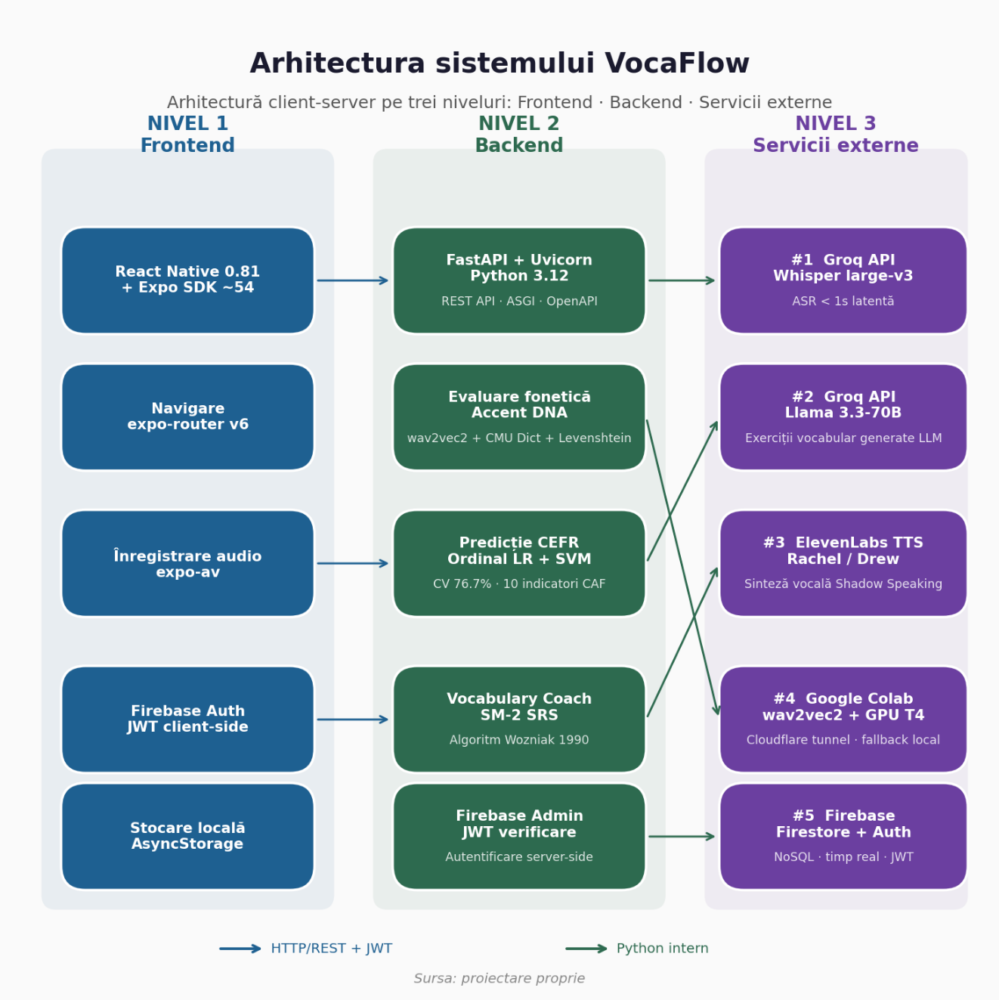
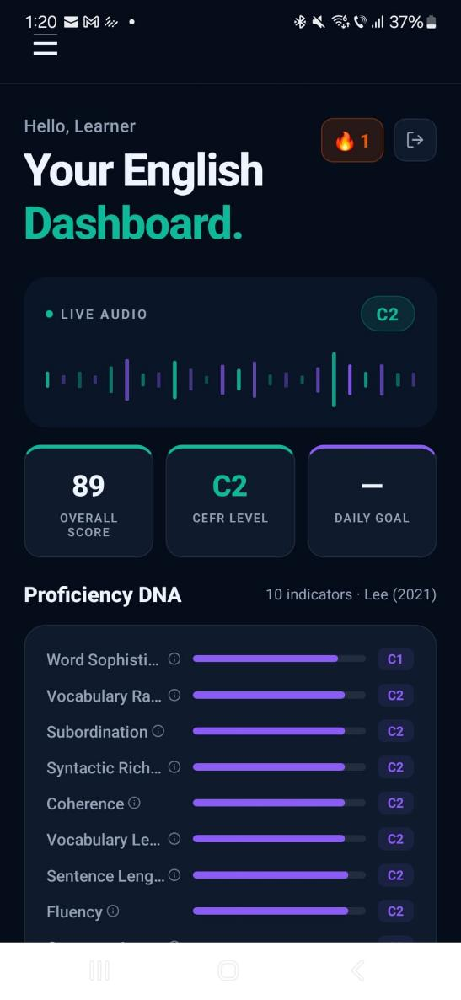
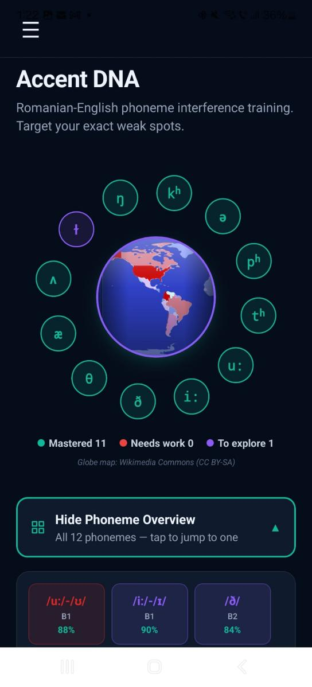
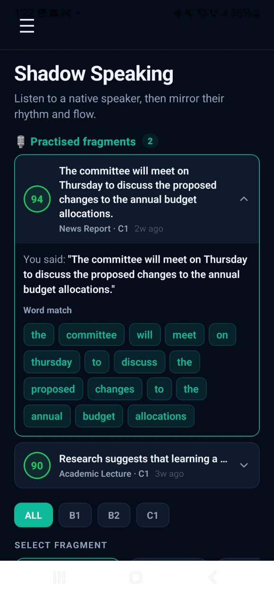
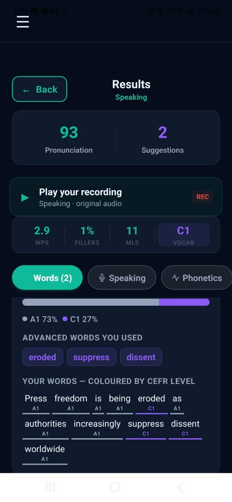
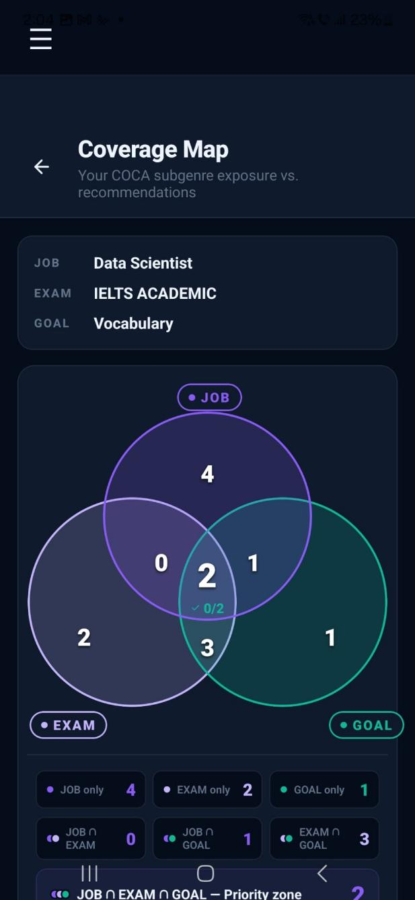
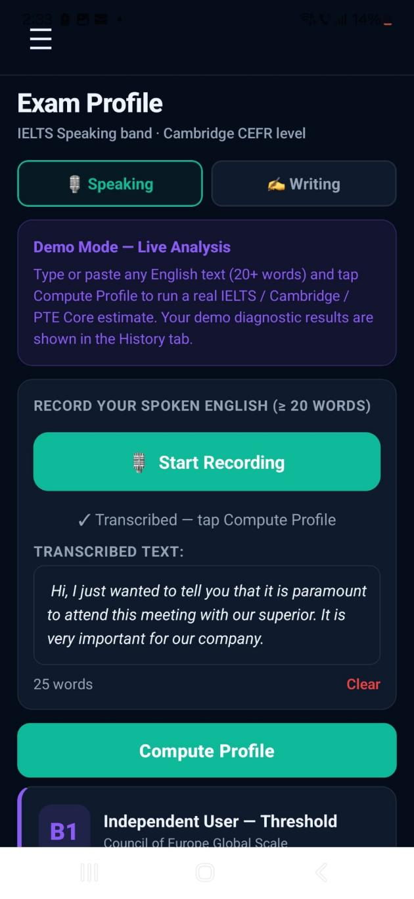

# VocaFlow — Adaptive English-Speaking Assessment Platform

VocaFlow is a full-stack, mobile-assisted language learning (MALL) application that diagnoses and trains spoken English for Romanian native speakers at CEFR levels B1–C1. It was developed as a bachelor's thesis project at the Bucharest University of Economic Studies, Faculty of Cybernetics, Statistics and Economic Informatics.

Unlike mainstream apps (Duolingo, ELSA Speak, Mondly) that focus on beginners and mechanical drills, VocaFlow targets intermediate-to-advanced learners who already understand English but struggle to produce it fluently, precisely, and under real-time pressure — the gap between "the English you know" and "the English you can use."

## Key Features

- **CEFR Diagnostic** — a 60–90 second free-speech assessment that predicts the user's CEFR level (A2–C2) using an ordinal logistic regression + SVM ensemble trained on 1,494 labeled texts (77.6% exact accuracy, 0.913 quadratic-weighted kappa).
- **Accent DNA** — phoneme-level pronunciation scoring calibrated on documented Romanian-English phonological interference patterns (e.g. /θ/ → [t], /ð/ → [d]), going beyond generic "correct/incorrect" feedback.
- **Shadow Speaking** — a fluency module based on the shadowing technique used in interpreter training, with side-by-side waveform comparison against native speaker audio.
- **Vocabulary Coach** — detects overused generic words (good, nice, thing, get...) in the user's speech and generates context-aware upgrade suggestions via an LLM, reinforced with an SM-2 spaced-repetition system.
- **Coverage Map** — a Venn-diagram view comparing the user's vocabulary exposure against job-, exam-, and goal-relevant subgenres of the COCA corpus.
- **Exam Profile** — estimated band/score projections for IELTS, Cambridge, and TOEFL based on extracted CAF (Complexity, Accuracy, Fluency) indicators.
- **Motivational design** — built on Self-Determination Theory and the Octalysis framework, deliberately avoiding public leaderboards and punitive streak mechanics.

## Architecture

VocaFlow follows a three-tier client-server architecture:

1. **Frontend** — React Native (Expo SDK) mobile client, communicating over authenticated HTTP/REST.
2. **Backend** — FastAPI (Python) server handling NLP, phonetic evaluation, and CAF analysis, exposed via JSON REST endpoints.
3. **Persistence & external services** — Firebase Authentication + Firestore for user data; Groq-hosted Whisper for ASR; a GPU-backed wav2vec2 model (Google Colab + Cloudflare tunnel, with a local CMU dictionary/Levenshtein fallback) for phoneme-level evaluation; ElevenLabs for text-to-speech.

## Tech Stack

| Layer | Technologies |
|---|---|
| Frontend | React Native, Expo SDK, TypeScript, expo-router, expo-av |
| Backend | Python 3.12, FastAPI, Uvicorn (ASGI) |
| Data & Auth | Firebase Authentication, Cloud Firestore |
| AI / ML | Whisper large-v3 (via Groq), wav2vec2-xlsr-53-espeak-cv-ft, Ordinal Logistic Regression + SVM (scikit-learn), Llama 3.3 (via Groq), ElevenLabs TTS |
| Linguistic resources | CMU Pronouncing Dictionary, English Vocabulary Profile, Nation BNC Word Lists, COCA, GMU Speech Accent Archive |

## Screenshots

| Dashboard & CEFR Diagnostic | Accent DNA |
|---|---|
|  |  |

| Shadow Speaking | Vocabulary Coach |
|---|---|
|  |  |

| Coverage Map | Exam Profile |
|---|---|
|  |  |

## Evaluation Highlights

- **CEFR prediction (in-corpus):** 75.3% exact accuracy, 97.7% adjacent accuracy, Pearson r = 0.892 (Kaggle CEFR Written Texts, N=1,494).
- **Phonetic assessment (pilot corpus):** Spearman ρ = 0.949 between system accuracy score and certified CEFR level (N=4 speakers, 28 audio files).
- **Usability study (SUS):** mean score 65.5 (N=15), with a polarized distribution between users experienced with MALL apps (75–85) and first-time users (30–50).
- **Documented limitation:** a cross-corpus generalization gap (written → spoken) caused by feature distribution shift in the Sentence Complexity indicator, analyzed in detail as a contribution to the MALL literature on ASR-based CAF extraction.

## Repository

Source code: [github.com/georgianaoniceanu/licenta1](https://github.com/georgianaoniceanu/licenta1)

## Author

**Georgiana-Daniela Oniceanu**
Bachelor's Thesis, Economic Informatics — Bucharest University of Economic Studies, 2026
Coordinator: Lect. univ. dr. Zurini Mădălina

## License

This project was developed for academic purposes as part of a bachelor's thesis. See repository for licensing details.
